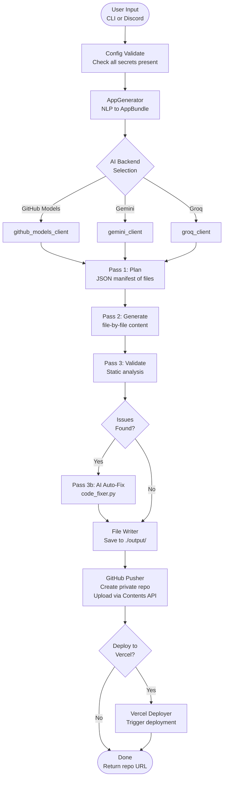

# Turmux Vibe AppBuilder — Project Handoff

> **Document type:** Engineering Handoff  
> **Last updated:** 2026-06-26  
> **Audience:** New engineers, contributors, open-source collaborators  
> **Status:** Active Development

---

## Table of Contents

1. [Executive Summary](#1-executive-summary)
2. [Repository Layout](#2-repository-layout)
3. [Quick Start — CLI](#3-quick-start--cli)
4. [Quick Start — Discord Bot](#4-quick-start--discord-bot)
5. [Architecture Tour](#5-architecture-tour)
6. [Pipeline Mermaid Diagram](#6-pipeline-mermaid-diagram)
7. [Key Design Decisions & Rationale](#7-key-design-decisions--rationale)
8. [Current State & Known Issues](#8-current-state--known-issues)
9. [Gotchas & Footguns](#9-gotchas--footguns)
10. [Where to Go Next](#10-where-to-go-next)

---

## 1. Executive Summary

**Turmux Vibe AppBuilder** is an AI-powered, full-stack application code generator. A user describes what they want in plain English and the system — through a structured multi-pass AI pipeline — returns a fully working codebase, pushed to a private GitHub repository, and optionally deployed live to Vercel.

The system is deliberately built to run on **Android via Termux** (no laptop required) as well as on any standard Linux server. Two first-class interfaces exist: a **Discord bot** (for mobile / async workflows) and a **CLI** (for local / Termux use).

### What it does in one sentence

> Given a plain-English app description, Turmux Vibe generates a complete project codebase with AI, pushes it to GitHub as a private repo, and optionally deploys it — all from your phone.

### Key numbers at a glance

| Metric | Value |
|--------|-------|
| AI passes per build | 3 (plan, generate, validate/fix) |
| Supported AI backends | 4 (GitHub Models, Gemini, Groq, local via config) |
| Supported models | 14+ across all backends |
| Discord slash commands | 7 |
| Mobile-ready | Yes — Termux/Android |
| Deployment targets | GitHub (always) + Vercel (optional) |

---

## 2. Repository Layout

```
appbuilder/
├── .env                    <- runtime secrets (never commit)
├── .env.example            <- template to copy
├── config.py               <- centralised env-var loading (dotenv)
├── requirements.txt        <- Python deps
├── Dockerfile              <- production container image
├── fly.toml                <- Fly.io deploy manifest
├── deploy.sh               <- one-shot deploy helper
├── termux_setup.sh         <- bootstrap script for Termux on Android
│
├── core/
│   ├── app_generator.py    <- NLP description -> AppBundle data class
│   ├── gemini_client.py    <- Gemini API wrapper (Pass 1 + Pass 2)
│   ├── github_models_client.py <- OpenAI-compat wrapper for GitHub Models
│   ├── groq_client.py      <- Groq inference client
│   ├── pipeline.py         <- master orchestrator (5 ordered steps)
│   ├── github_pusher.py    <- creates private repo, pushes via Contents API
│   ├── file_writer.py      <- saves generated files to local disk
│   ├── code_validator.py   <- static analysis / lint pass
│   ├── code_fixer.py       <- AI-powered auto-fix (Pass 3)
│   ├── repo_updater.py     <- fetch existing repo + AI diff-apply updates
│   └── vercel_deployer.py  <- triggers Vercel deployment via API
│
├── discord_bot/
│   └── bot.py              <- discord.py async bot, all slash commands
│
└── cli/
    └── build.py            <- synchronous CLI entry point
```

---

## 3. Quick Start — CLI

### Prerequisites

```bash
# Python 3.10+ required
python --version

# Clone the repo
git clone <your-fork> appbuilder
cd appbuilder

# Create virtualenv (recommended)
python -m venv .venv
source .venv/bin/activate

# Install dependencies
pip install -r requirements.txt
```

### Configure secrets

```bash
cp .env.example .env
# Open .env and fill in at minimum:
#   GITHUB_TOKEN=ghp_...
#   GITHUB_USERNAME=your-github-handle
# Optionally add GEMINI_API_KEY, GROQ_API_KEY, etc.
```

### Run a build

```bash
# Basic build (uses GitHub Models by default, no extra API key needed)
python cli/build.py "Build me a FastAPI REST API with SQLite CRUD for a todo list app"

# Specify a model explicitly
python cli/build.py --model gpt-4o "Build a Next.js landing page for a SaaS startup"

# Build and deploy to Vercel
python cli/build.py --deploy "Build a React weather app using OpenWeatherMap"
```

### Termux / Android setup

```bash
# One-time bootstrap (installs Python, git, clones repo, sets up .env)
bash termux_setup.sh
```

The `termux_setup.sh` script handles Termux-specific quirks (storage permissions, pkg updates, git config). After running it, the standard CLI commands work identically.

---

## 4. Quick Start — Discord Bot

### Bot setup

1. Create a Discord application at https://discord.com/developers/applications
2. Under **Bot**, generate a token and enable **Message Content Intent** and **Server Members Intent**
3. Under **OAuth2 -> URL Generator**, select `bot` + `applications.commands` scopes, and `Send Messages`, `Use Slash Commands` permissions
4. Invite the bot to your server using the generated URL
5. Set `DISCORD_BOT_TOKEN` in your `.env`

### Start the bot

```bash
python discord_bot/bot.py
```

### Available slash commands

| Command | Description |
|---------|-------------|
| `/build <description>` | Generate a new app from a plain-English description |
| `/update <repo> <changes>` | Apply AI-powered changes to an existing repo |
| `/model <name>` | Switch the active AI model at runtime |
| `/status` | Show current model, job queue, and system health |
| `/keys` | Display which API keys are configured (masked) |
| `/apiinfo` | Show backend capabilities and rate limits |
| `/cmd <shell_command>` | (Admin) Run a shell command on the host |

### Example Discord session

```
User:  /build Build a Discord bot that tracks user XP and levels
Bot:   Starting generation pipeline...
       Pass 1: Planning (12 files detected)
       Pass 2: Generating files... [1/12] [2/12] ... [12/12]
       Pass 3: Validating + fixing...
       Pushing to GitHub...
       Done! Repo: https://github.com/you/discord-xp-bot-abc123
       Deploying to Vercel... https://discord-xp-bot-abc123.vercel.app
```

---

## 5. Architecture Tour

### `config.py`

Central configuration loader. Reads all environment variables via `python-dotenv`. Any module that needs a secret imports from here — never reads `os.environ` directly. This is the single source of truth for configuration.

**Important:** All secrets are loaded at module import time. If `.env` is malformed, you get an early crash with a clear error — by design.

### `core/app_generator.py`

Converts a plain-English description into an `AppBundle` data class. This module contains the NLP pre-processing logic: extracting tech stack hints, feature keywords, naming the repo, and setting initial metadata. The `AppBundle` object is the contract between the front-end interfaces (CLI, Discord) and the pipeline.

### `core/gemini_client.py`

Wraps the Google Generative AI SDK. Implements two key methods:

- `plan(description) -> dict` — Pass 1: asks the model to return a JSON manifest of files to generate
- `generate_file(filename, spec, context) -> str` — Pass 2: generates one file's content

Handles exponential backoff on `429 RESOURCE_EXHAUSTED` errors. Uses `gemini-2.5-flash` by default with fallback to `gemini-2.0-flash`.

### `core/github_models_client.py`

OpenAI-compatible client pointing at `https://models.inference.ai.azure.com`. Uses `GITHUB_TOKEN` — no additional paid API key. Supports: GPT-4o, GPT-4o-mini, Llama-3.3-70B, Llama-3.1-405B, Claude-3.5-Sonnet, Mistral-Large, Phi-4. This is the **default backend** because it requires only the GitHub token every developer already has.

### `core/groq_client.py`

Thin wrapper over the `groq` Python SDK. Supports: `llama-3.3-70b-versatile`, `llama-3.1-8b-instant`, `mixtral-8x7b`, `gemma2-9b`. Groq's Llama models are excellent for fast iteration; useful when Gemini rate limits are hit.

### `core/pipeline.py`

The master orchestrator. Defines five ordered steps:

1. **Config validate** — Check all required secrets are present
2. **AppGenerator** — NLP -> AppBundle
3. **AI Generation** — Pass 1 (plan) + Pass 2 (generate) + Pass 3 (validate/fix)
4. **File writer** — Save files to local disk under `./output/<repo-name>/`
5. **GitHub push** — Create private repo, upload all files via Contents API
6. **Vercel deploy** *(optional)* — Trigger deployment

Each step is a method; errors bubble up with context-rich exceptions. The pipeline is a linear state machine — no parallelism — to keep things debuggable.

### `core/github_pusher.py`

Uses **PyGithub** to:
1. Create a new private repository under the authenticated user's account
2. Push each generated file one-by-one via the Contents API (base64-encoded)

Uses Contents API instead of `git push` because Termux environments may not have `git` configured with SSH, and the API approach requires only an HTTP token.

### `core/file_writer.py`

Simple utility: takes the `AppBundle` with generated file contents and writes them to `./output/<repo-name>/`. Handles directory creation and filename sanitization.

### `core/code_validator.py`

Static analysis pass. Runs configured linters/checkers against generated files. Produces a list of `ValidationIssue` objects with severity levels. Does **not** modify files — only reports.

### `core/code_fixer.py`

AI-powered auto-fix (Pass 3). Takes `ValidationIssue` objects from the validator, formats them into a prompt, and asks the AI to return fixed file contents. This is the "write your own code reviewer" pattern.

### `core/repo_updater.py`

Handles the `/update` command flow:
1. Fetches all current files from an existing GitHub repo via the Contents API
2. Passes the current codebase + user's change description to the AI
3. AI returns a diff of changes (added/modified/deleted files)
4. Applies the diff and re-pushes

### `core/vercel_deployer.py`

Calls the Vercel REST API to trigger a deployment from the newly pushed GitHub repo. Requires `VERCEL_TOKEN` and `VERCEL_TEAM_ID` (optional). Returns the deployment URL.

### `discord_bot/bot.py`

Async discord.py bot. Each slash command is a `@bot.tree.command()` decorated coroutine. The bot calls `pipeline.run()` in a `ThreadPoolExecutor` to avoid blocking the event loop during the (potentially long) generation process. Progress updates are sent as Discord message edits.

### `cli/build.py`

Synchronous CLI wrapper using `argparse`. Calls the same pipeline as the Discord bot. Designed to work in Termux where async event loops can be tricky. Outputs progress to stdout with ANSI color codes (gracefully degrades on Termux).

---

## 6. Pipeline Mermaid Diagram



---

## 7. Key Design Decisions & Rationale

### Two-pass generation (Plan then Generate)

A single prompt asking the AI to "generate a complete app" produces poor results — the model either truncates files or loses coherence. By separating planning (what files exist, what each does) from generation (write the actual code), each pass has a focused, bounded task. The plan also serves as a manifest we can show to users for early feedback.

### GitHub Contents API over `git push`

The PyGithub Contents API approach works on any platform — including Termux on Android — without requiring `git` to be configured with SSH keys or GPG. The trade-off is that large repos (100+ files) are slow due to serial API calls, but for generated apps (typically 5-20 files) this is acceptable.

### GitHub Models as default backend

GitHub Models uses the same token every developer already has. No credit card, no separate API account. This radically lowers the barrier to entry. The OpenAI-compatible endpoint means swapping to a real OpenAI key later requires changing one URL.

### Discord as primary async UI

Code generation takes 30-120 seconds. Discord's persistent message editing pattern (edit the same message with progress updates) is ideal for this. Users can trigger a build from their phone and come back to find the result. Discord also handles authentication, rate limiting, and push notifications for free.

### Termux / mobile-first

Many developers in emerging markets rely on phones rather than laptops. By ensuring the tool works on Termux (Android), we unlock a large potential user base. This shaped the decision to avoid `git` subprocess calls, avoid GUI tooling, and keep the CLI output simple.

---

## 8. Current State & Known Issues

### What works well

- GitHub Models + Gemini generation pipeline is stable
- Discord bot slash commands functional
- CLI works on Termux and Linux
- Repo update flow (`/update`) correctly fetches and diffs
- Vercel auto-deploy works for static sites and Next.js apps

### Known issues

| Issue | Severity | Notes |
|-------|----------|-------|
| Large file generation (>500 lines) sometimes truncates | Medium | Model context window limits; workaround: split into smaller files |
| Groq `mixtral-8x7b` occasionally returns non-JSON in Pass 1 | Medium | Code_validator catches it, but requires a retry |
| Vercel deploy fails for Python/FastAPI backends | Low | Vercel has limited Python runtime support; document this |
| `/cmd` Discord command has no sandboxing | High | Do not expose the bot to untrusted servers |
| Rate limit backoff uses fixed sleep intervals | Low | Should use exponential backoff with jitter |
| No test suite | High | Zero automated tests; all validation is manual |

### Technical debt

- `pipeline.py` is a monolith; should be refactored into composable step classes
- `config.py` does not validate secret formats (e.g., `ghp_` prefix for GitHub tokens)
- Error messages from AI backends are re-raised as generic `Exception` — needs typed exceptions
- Discord bot stores no state; if it restarts mid-generation, the job is lost

---

## 9. Gotchas & Footguns

### Never commit `.env`

The `.gitignore` should exclude `.env`. Double-check before pushing. `GITHUB_TOKEN` in your repo = instant security incident.

### GitHub Models rate limits are per-token, not per-IP

If you share a `GITHUB_TOKEN` across multiple users or bot instances, you will hit rate limits faster than expected. Each instance should use its own token.

### Pass 2 is sequential, not parallel

Files are generated one at a time. For a 15-file app, expect 2-5 minutes. Do not assume it's hung — check the progress logs.

### The `/cmd` command runs as the bot's OS user

There is **zero sandboxing**. Restrict `/cmd` to admin users only via Discord role checks, and ideally disable it in production.

### Vercel deployment requires repo access

By default, generated repos are private. If Vercel can't access the repo, deployment silently fails. Grant Vercel access to your GitHub org/account in Vercel's GitHub integration settings.

### `repo_updater.py` fetches ALL files on every `/update` call

For large repos this is slow and burns GitHub API rate limits. There's no incremental fetch — it's always a full snapshot.

### The AI sometimes generates files with placeholder comments

Patterns like `# TODO: implement this` or `// fill in auth logic` appear in generated code. The validator doesn't catch these. Users should review generated code before deploying.

### Termux storage permissions

On fresh Termux installs, `termux-setup-storage` must be run before `git clone`. The `termux_setup.sh` script handles this, but if you're setting up manually, this is easy to miss.

---

## 10. Where to Go Next

### Immediate priorities (P0)

1. **Add a test suite** — at minimum, integration tests for the pipeline with mocked AI clients
2. **Sandbox the `/cmd` command** — add admin-role check, log all invocations
3. **Add typed exceptions** — replace bare `Exception` with `PipelineError`, `AIBackendError`, etc.

### Short-term improvements (P1)

- Parallel file generation in Pass 2 (use `asyncio.gather` or `ThreadPoolExecutor`)
- Streaming progress updates in Discord (websocket / SSE)
- Persist build jobs to SQLite so the bot can resume after restart

### Exploration (P2)

- Web UI frontend (React/Next.js) as a third interface
- Support for GitLab and Bitbucket in addition to GitHub
- Agent loop: let the AI validate, fix, and re-validate autonomously until passing

### Good first issues for new contributors

- Add `--dry-run` flag to CLI that prints the plan but doesn't generate files
- Add `VERCEL_TOKEN` validation with a helpful error message
- Document all environment variables in README with examples
- Add `--output-dir` flag to CLI to control where files are saved
- Add `/cancel` Discord command to abort an in-progress build

---

*End of HANDOFF.md*
