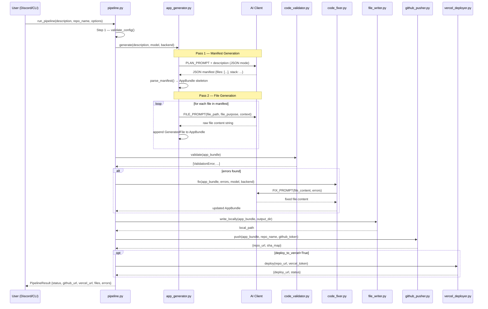
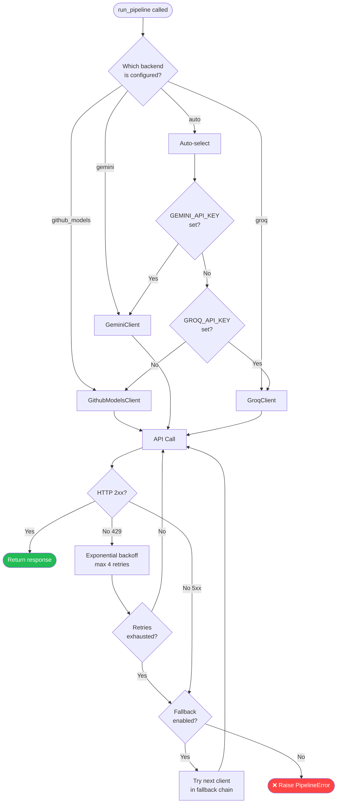

# 🔬 Turmux Vibe AppBuilder — Deep Technical Specification

> **Document type:** Internal technical specification  
> **Audience:** Senior engineers, contributors, system architects  
> **Last updated:** 2026-06-26  

---

## Table of Contents

1. [System Architecture](#1-system-architecture)
2. [Pipeline Flow Diagram](#2-pipeline-flow-diagram)
3. [AI Client Selection Logic](#3-ai-client-selection-logic)
4. [Data Models](#4-data-models)
5. [API Contracts](#5-api-contracts)
6. [AI Prompt Design](#6-ai-prompt-design)
7. [GitHub API Integration](#7-github-api-integration)
8. [Discord Bot Architecture](#8-discord-bot-architecture)
9. [Error Handling Strategy](#9-error-handling-strategy)
10. [Rate Limits Reference](#10-rate-limits-reference)
11. [Environment Variables Reference](#11-environment-variables-reference)

---

## 1. System Architecture

The system is organized into three layers:

```
┌─────────────────────────────────────────────────────┐
│                  INTERFACE LAYER                    │
│        Discord Bot (async)  │  CLI (sync)           │
└──────────────────┬──────────────────────────────────┘
                   │
┌──────────────────▼──────────────────────────────────┐
│                 ORCHESTRATION LAYER                 │
│   pipeline.py → app_generator.py → validators       │
└──────────────────┬──────────────────────────────────┘
                   │
┌──────────────────▼──────────────────────────────────┐
│                 INTEGRATION LAYER                   │
│  AI Clients │ GitHub Pusher │ Vercel Deployer       │
└─────────────────────────────────────────────────────┘
```

**Principle:** Each layer only calls downward. The Discord bot never directly calls `github_pusher`; it always goes through `pipeline.py`.

---

## 2. Pipeline Flow Diagram



---

## 3. AI Client Selection Logic



**Fallback chain order:** `github_models → gemini → groq`

If all three fail, `PipelineError` is raised with the aggregated error messages from all attempts.

---

## 4. Data Models

### `GeneratedFile`

```python
@dataclass
class GeneratedFile:
    path: str           # Relative path, e.g. "src/components/App.tsx"
    content: str        # Raw file content (never base64 internally)
    purpose: str        # From manifest: "Main React component"
    language: str       # Inferred: "typescript", "python", "json", etc.
    sha: str | None     # Set after GitHub push; the blob SHA
```

### `AppBundle`

```python
@dataclass
class AppBundle:
    description: str            # Original user description
    stack: str                  # e.g. "FastAPI + React + SQLite"
    files: list[GeneratedFile]
    manifest: dict              # Raw parsed JSON from Pass 1
    model: str                  # Model used for generation
    backend: str                # "github_models" | "gemini" | "groq"
    generated_at: datetime
```

### `PipelineResult` (dict schema)

```python
{
    "status": "success" | "partial" | "failed",
    "github_url": "https://github.com/user/repo",   # None if push failed
    "vercel_url": "https://app.vercel.app",          # None if not deployed
    "local_path": "/path/to/output/dir",
    "files": [
        {
            "path": "main.py",
            "content": "...",
            "sha": "abc123...",
            "language": "python"
        }
    ],
    "validation_errors": [...],   # Empty list if all passed
    "fix_attempts": 1,            # Number of Pass 3 fix cycles
    "model_used": "gpt-4o-mini",
    "backend_used": "github_models",
    "elapsed_seconds": 47.3,
    "error": None | "Error message if status=failed"
}
```

### `ValidationError`

```python
@dataclass
class ValidationError:
    file_path: str
    line: int | None
    column: int | None
    message: str
    severity: str   # "error" | "warning"
    source: str     # "pyflakes" | "ast" | "json" | "custom"
```

---

## 5. API Contracts

### `pipeline.run_pipeline()`

```python
def run_pipeline(
    description: str,           # Required. Plain-English app description.
    repo_name: str | None,      # Optional. Auto-generated if None.
    backend: str = "auto",      # "auto" | "github_models" | "gemini" | "groq"
    model: str | None = None,   # Override default model for selected backend
    deploy_to_vercel: bool = False,
    output_dir: str | None = None,  # Local save dir. Temp dir if None.
    dry_run: bool = False,      # Skip GitHub push and Vercel deploy
    max_fix_attempts: int = 2,  # Pass 3 fix cycles
) -> dict:                      # PipelineResult schema above
    ...
```

**Raises:** `ConfigError` if secrets are missing. `PipelineError` if all AI backends fail after retries.

---

### `app_generator.AppGenerator.generate()`

```python
def generate(
    self,
    description: str,
    client: BaseAIClient,       # Injected AI client (duck typing)
) -> AppBundle:
    ...
```

**Pass 1 call** — `client.complete_json(PLAN_PROMPT.format(description=description))`  
**Pass 2 call** — `client.complete(FILE_PROMPT.format(...))` for each file in manifest  

**Raises:** `GenerationError` if JSON parse of manifest fails after 3 attempts.

---

### `BaseAIClient` (Protocol / ABC)

All three AI clients implement this interface:

```python
class BaseAIClient(Protocol):
    def complete(
        self,
        prompt: str,
        temperature: float = 0.4,
        max_tokens: int = 4096,
    ) -> str: ...

    def complete_json(
        self,
        prompt: str,
        temperature: float = 0.2,
        max_tokens: int = 2048,
    ) -> dict: ...

    @property
    def model_name(self) -> str: ...

    @property
    def backend_name(self) -> str: ...
```

---

### `github_pusher.push_app_bundle()`

```python
def push_app_bundle(
    app_bundle: AppBundle,
    repo_name: str,
    github_token: str,
    private: bool = True,
    commit_message: str = "Initial commit via Turmux AppBuilder",
    description: str | None = None,    # GitHub repo description
) -> dict:
    # Returns:
    {
        "repo_url": "https://github.com/user/repo-name",
        "clone_url": "https://github.com/user/repo-name.git",
        "sha_map": {"main.py": "abc123...", ...},
        "files_pushed": 8,
    }
```

---

### `repo_updater.update_repo()`

```python
def update_repo(
    repo_url: str,              # Existing GitHub repo URL
    update_description: str,   # What to change
    github_token: str,
    client: BaseAIClient,
    commit_message: str | None = None,
) -> dict:
    # Returns PipelineResult-compatible dict
    # with only changed/added/deleted files populated
```

---

## 6. AI Prompt Design

### 6.1 PLAN_PROMPT (Pass 1)

**Purpose:** Extract a structured file manifest from a free-form description.

```
You are an expert software architect. Given the app description below, output a JSON manifest listing every file needed to implement the app. Do not generate code.

App description: {description}

Output ONLY valid JSON with this structure:
{{
  "stack": "string describing tech stack",
  "files": [
    {{
      "path": "relative/file/path.ext",
      "purpose": "one sentence describing this file's role",
      "dependencies": ["other/file.ext"]
    }}
  ]
}}

Rules:
- Include all files: README.md, requirements.txt or package.json, .gitignore, etc.
- Maximum 20 files for simple apps, 40 for complex ones
- Use realistic, production-style file paths
- Output ONLY the JSON object. No explanation, no markdown fences.
```

**Why JSON mode?** Without JSON mode, models pad the response with prose before and after the JSON, making parsing fragile. With JSON mode (`response_mime_type="application/json"` for Gemini; `response_format={"type":"json_object"}` for OpenAI-compat), the output is guaranteed to be parseable.

**Temperature 0.2** for the plan: low temperature produces more consistent file lists, avoids creative file naming, and reduces hallucinated imports.

---

### 6.2 FILE_PROMPT_TEMPLATE (Pass 2)

**Purpose:** Generate the full content of a single file.

```
You are an expert {language} developer. Generate the complete, production-ready content for the file described below.

App description: {description}
Tech stack: {stack}
File to generate: {file_path}
File purpose: {file_purpose}

Other files in this project:
{file_list}

{coding_standards}

Rules:
- Output ONLY the raw file content. No explanation. No markdown code fences.
- Use real imports, not placeholder comments like "# add your code here"
- Assume all other files listed above exist and have correct implementations
- The code must be complete and runnable

File content:
```

**Per-file vs all-at-once:** Generating all files in one prompt causes token overflow for any non-trivial app and produces files with inconsistent naming. Per-file generation allows:
- Each file to have its full token budget
- Context from the manifest (what other files exist)
- Isolated retry if one file fails

**Temperature 0.4** for file generation: slightly higher than plan to allow realistic code variety while staying deterministic enough for correctness.

**"No markdown fences" rule:** Necessary because if the model wraps output in ` ```python ... ``` `, the fence characters end up written to the actual file. We strip fences anyway as a safety net, but the instruction reduces occurrence dramatically.

---

### 6.3 CODING_STANDARDS Injection

A per-language snippet injected into `FILE_PROMPT_TEMPLATE`:

```python
CODING_STANDARDS = {
    "python": """
- Follow PEP 8 style
- Use type hints on all function signatures
- Add docstrings to all classes and public functions
- Prefer f-strings over .format()
""",
    "typescript": """
- Use strict TypeScript (no `any`)
- Use async/await, not .then() chains
- Export types separately from implementations
""",
    "javascript": """
- Use ES2022+ syntax (optional chaining, nullish coalescing)
- Prefer const over let; never use var
""",
    # ...
}
```

---

### 6.4 Repo Updater Prompt (diff strategy)

```
You are modifying an existing codebase. Below is the current content of all relevant files.

Update request: {update_description}

Current files:
{file_contents}

Output ONLY the files that need to be created, modified, or deleted.
For each changed file, output:
FILE: path/to/file.ext
CONTENT:
<complete new file content>
END_FILE

For deleted files:
DELETE: path/to/file.ext

Do not output unchanged files.
```

This custom format (not JSON) is used because asking for a JSON diff of file contents causes escaping issues with code strings containing quotes, backslashes, and newlines.

---

### 6.5 JSON Parse Safety Net

```python
def safe_parse_json(raw: str) -> dict:
    """Strip markdown fences, try parse, attempt recovery."""
    # 1. Strip ```json ... ``` fences
    raw = re.sub(r'^```(?:json)?\s*', '', raw.strip())
    raw = re.sub(r'\s*```$', '', raw)
    
    try:
        return json.loads(raw)
    except json.JSONDecodeError:
        # 2. Try extracting the first JSON object
        match = re.search(r'\{.*\}', raw, re.DOTALL)
        if match:
            try:
                return json.loads(match.group())
            except json.JSONDecodeError:
                pass
    
    # 3. Give up — return minimal valid manifest
    raise GenerationError(f"Could not parse JSON after safety net: {raw[:200]}")
```

---

## 7. GitHub API Integration

### Contents API vs Git CLI

| Criterion | Contents API | Git CLI |
|---|---|---|
| Availability on Termux | ✅ Always (HTTP) | ❌ Requires `pkg install git` |
| Binary file support | ⚠️ Up to 100MB | ✅ Unlimited |
| Merge/branch operations | ❌ Limited | ✅ Full |
| Auth method | Token in header | Credential helper |
| Atomic commit (multi-file) | ❌ One file per request | ✅ Batch commit |
| Speed for <50 files | ✅ ~1s per file | ✅ Fast |
| Dependencies | `requests` / PyGithub | `git` binary |

**Decision: Contents API.** Trade-offs are acceptable for generated apps which are typically <30 files, all text, with no complex branching needed.

### PyGithub Usage

```python
from github import Github

g = Github(github_token)
user = g.get_user()

# Create private repo
repo = user.create_repo(
    name=repo_name,
    description=description,
    private=True,
    auto_init=False,    # We handle the initial commit
)

# Push a file (base64 encoding handled by PyGithub)
repo.create_file(
    path=file.path,
    message=commit_message,
    content=file.content,   # PyGithub handles encoding
    branch="main",
)
```

**Note:** For updating existing files, use `repo.update_file()` with the blob SHA. The SHA is required — fetch it first with `repo.get_contents(path)`.

---

## 8. Discord Bot Architecture

### Async Executor Pattern

Discord's event loop must never be blocked. The pipeline can take 30–90 seconds. Pattern used:

```python
import asyncio
from concurrent.futures import ThreadPoolExecutor

executor = ThreadPoolExecutor(max_workers=4)

@bot.tree.command(name="build")
async def build_command(interaction: discord.Interaction, description: str):
    await interaction.response.defer(thinking=True)  # ACK within 3s
    
    loop = asyncio.get_event_loop()
    result = await loop.run_in_executor(
        executor,
        lambda: run_pipeline(description=description)  # Sync call in thread
    )
    
    embed = build_result_embed(result)
    await interaction.followup.send(embed=embed)
```

### Slash Command Summary

| Command | Parameters | Description |
|---|---|---|
| `/build` | `description: str`, `model?: str` | Generate a new app from description |
| `/update` | `repo: str`, `description: str` | Update an existing repo |
| `/model` | `action: list\|set`, `name?: str` | List or switch AI model |
| `/status` | — | Show last job status + metrics |
| `/keys` | `action: check\|set`, `key_name?: str`, `value?: str` | Check or set API keys at runtime |
| `/apiinfo` | `backend?: str` | Show rate limits and model info |
| `/cmd` | `command: str` | Run a safe CLI command (e.g., `ls`, `python --version`) |

### Guild-Scoped Command Registration

Commands are registered to a specific guild (server) during development for instant sync. In production, global registration is used (propagates in up to 1 hour).

```python
if DISCORD_GUILD_ID:
    guild = discord.Object(id=int(DISCORD_GUILD_ID))
    bot.tree.copy_global_to(guild=guild)
    await bot.tree.sync(guild=guild)
else:
    await bot.tree.sync()
```

---

## 9. Error Handling Strategy

### Retry with Exponential Backoff

```python
import time

def with_retry(fn, max_retries=4, base_delay=2.0):
    last_error = None
    for attempt in range(max_retries):
        try:
            return fn()
        except RateLimitError as e:
            last_error = e
            delay = base_delay * (2 ** attempt)   # 2, 4, 8, 16 seconds
            time.sleep(delay)
        except (ServerError, TimeoutError) as e:
            last_error = e
            time.sleep(base_delay)
    raise last_error
```

### Graceful Degradation Levels

| Level | Behavior |
|---|---|
| L0: Nominal | All passes succeed, push succeeds |
| L1: Fix needed | Pass 3 catches errors, auto-fix applied, push succeeds |
| L2: Fix failed | Push partial AppBundle with warning in PipelineResult |
| L3: Push failed | Save locally, return local path in result |
| L4: Generation failed | Return PipelineError to caller with detailed message |

### What We Log

Every pipeline run logs:
- `timestamp`, `model`, `backend`, `description_length`
- Pass 1 duration, file count
- Pass 2 duration, per-file durations
- Validation error count
- Fix attempt count
- Push success/failure + file count
- Total elapsed time

---

## 10. Rate Limits Reference

| Backend | Model | RPM | TPM | TPD | Notes |
|---|---|---|---|---|---|
| GitHub Models | gpt-4o-mini | 15 | 150,000 | 1,000,000 | Free tier |
| GitHub Models | gpt-4o | 8 | 8,000 | 50,000 | Free tier |
| GitHub Models | llama-3.3-70b | 15 | 150,000 | — | |
| GitHub Models | claude-3.5-sonnet | 5 | 20,000 | — | Lowest limit |
| Gemini | 2.5-flash | 15 | 1,000,000 | — | Free tier |
| Gemini | 2.5-pro | 5 | 250,000 | — | Free tier |
| Groq | llama-3.3-70b | 30 | 6,000 | 500,000 | |
| Groq | mixtral-8x7b | 30 | 5,000 | 250,000 | |

> **TPM** = Tokens Per Minute, **RPM** = Requests Per Minute, **TPD** = Tokens Per Day  
> Limits are approximate and subject to change. Always check provider dashboards.

**Key insight:** GitHub Models has the most generous TPM limit but lowest RPD for GPT-4o. For high-volume generation, Gemini 2.5-flash is the best free-tier option.

---

## 11. Environment Variables Reference

| Variable | Purpose | Required | Default | Notes |
|---|---|---|---|---|
| `GITHUB_TOKEN` | GitHub API auth + GitHub Models | ✅ Yes | — | Needs `repo` scope |
| `GEMINI_API_KEY` | Gemini AI backend | Optional | — | From Google AI Studio |
| `GROQ_API_KEY` | Groq inference backend | Optional | — | From console.groq.com |
| `DISCORD_BOT_TOKEN` | Discord bot auth | For bot only | — | From Discord Dev Portal |
| `DISCORD_GUILD_ID` | Restrict commands to guild | Optional | — | Faster command sync |
| `DEFAULT_MODEL` | Default AI model | Optional | `gpt-4o-mini` | |
| `DEFAULT_BACKEND` | Default AI backend | Optional | `github_models` | |
| `DEFAULT_PRIVATE_REPO` | Make repos private by default | Optional | `true` | |
| `VERCEL_TOKEN` | Vercel deploy API | Optional | — | For auto-deploy |
| `VERCEL_TEAM_ID` | Vercel team scope | Optional | — | For team accounts |
| `OUTPUT_DIR` | Local file save directory | Optional | System temp | |
| `MAX_FIX_ATTEMPTS` | Pass 3 retry cap | Optional | `2` | |
| `ENABLE_FALLBACK` | Enable backend fallback chain | Optional | `true` | |
| `LOG_LEVEL` | Logging verbosity | Optional | `INFO` | |
| `FLY_APP_NAME` | Fly.io app name | For Fly deploy | — | |
